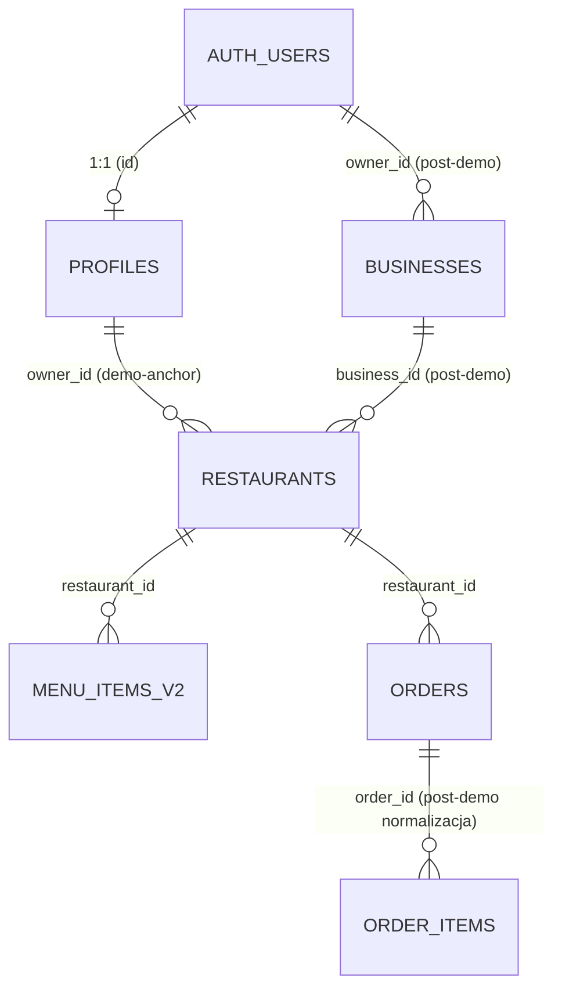

# FreeFlow — Finalny plan hardeningu i konsolidacji Supabase przed publicznym demo

- **Projekt Supabase:** `ezemaacyyvbpjlagchds`
- **Data przygotowania:** 2026-08-06
- **Autor:** Opus 5 (analiza statyczna repo backend + frontend, bez wykonania SQL na live)
- **Status:** dokument projektowy. Nic w tym pliku nie zostało wykonane na bazie live.
- **Zakaz wykonania:** żaden blok SQL w tym dokumencie nie może zostać uruchomiony na
  projekcie `ezemaacyyvbpjlagchds` bez osobnej, jawnej decyzji operacyjnej (patrz §13, §14).

## Legenda wiarygodności ustaleń

Każde stwierdzenie o stanie bazy live jest oznaczone jednym z dwóch tagów:

- **[POTWIERDZONE]** — wynika z audytu bezpieczeństwa dostarczonego przez użytkownika, z kodu
  repozytorium (plik:linia), albo z obu naraz. Traktowane jako fakt.
- **[DO WERYFIKACJI]** — wniosek prawdopodobny na podstawie kodu, ale niepotwierdzony
  bezpośrednim odczytem `information_schema` / `pg_catalog` na live (ten dokument nie miał
  uprawnień do wykonania takiego odczytu — patrz §14a). Wymaga zapytania z §10 przed działaniem.

Nigdzie w tym dokumencie hipoteza nie jest przedstawiona jako fakt bez jednego z powyższych tagów.

---

## 0. Streszczenie wykonawcze i tabela ryzyk

### Stan obecny

Projekt Supabase FreeFlow działa produkcyjnie bez podstawowej warstwy izolacji dostępu:

- 16 tabel `public` bez RLS i z szerokimi grantami **[POTWIERDZONE — audyt]**.
- `orders` — zawiera PII (`customer_name`, `customer_phone`, `delivery_address`) i pozwala
  na anon `SELECT` oraz public `INSERT` **[POTWIERDZONE — audyt]**. Dodatkowo `DELETE
  /api/orders` (kasuje wszystkie zamówienia) i `PATCH /api/orders/:id` (dowolna zmiana
  statusu) nie mają żadnej autoryzacji na poziomie backendu
  **[POTWIERDZONE — kod: `api/orders.js:471-490`, `:495-535`]**.
- Dwa security-definer views: **`full_orders_view`**, **`amber_tts_daily`**
  **[POTWIERDZONE — audyt]**.
- Publiczne funkcje z mutable `search_path` **[POTWIERDZONE — audyt]**; konkretne nazwy
  do domknięcia zapytaniem inwentaryzacyjnym z §10 (kandydaci z kodu w §5).
- `VITE_ADMIN_TOKEN` — realny sekret autoryzujący panel admina/KDS — jest wkompilowany
  do frontendowego bundla i wysyłany jako nagłówek `x-admin-token`
  **[POTWIERDZONE — kod: `frontend/src/lib/kdsApi.ts:257,261`,
  `businessApi.ts:148`, weryfikacja po stronie `api/admin/adminRouter.js:33`]**.
- Schemat live rozjechał się z oczekiwaniami kodu: `OrderPersistence.js` zapisuje
  `session_id`, `idempotency_key`, `total_cents`, status `confirmed` — kolumny, których
  produkcyjny insert w `api/orders.js:280` jawnie unika („Commented out to prevent column
  does not exist error”) **[POTWIERDZONE — kod]**. Ścieżka `persistOrderToDB` jest dziś
  **wyłączona** w `api/brain/domains/food/confirmHandler.js:55-60`
  **[POTWIERDZONE — kod]**.
- Brak lokalnej historii migracji: `backend/migrations/` zawiera jeden plik
  (`001_live_perf_logs.sql`), brak katalogu `supabase/migrations/`
  **[POTWIERDZONE — kod]**.

### Stan docelowy (po pełnym wdrożeniu §9)

- Przeglądarka ma dostęp wyłącznie do katalogu publicznego (`restaurants`, `menu_items_v2`,
  kolumny live-safe) poprzez klucz anon/publishable.
- Wszystko wrażliwe (`orders`, `profiles`, logi, config) — deny-all dla anon/authenticated,
  obsługiwane wyłącznie przez autoryzowane endpointy backendu na service_role.
- Backend rozdziela dwa klienty Supabase świadomie, zamiast jednego globalnego z cichym
  fallbackiem.
- Widoki i funkcje mają ustawiony `search_path` i właściwy tryb bezpieczeństwa.
- Realtime na `orders` — wyłączone (decyzja w §6), zastąpione pollingiem, który już działa.
- `menu_items` — zamrożone jako martwy rollback, `menu_items_v2` jedynym źródłem prawdy.

### Tabela ryzyk (priorytet malejący)

| # | Ryzyko | Priorytet | Dowód | Sekcja |
|---|---|---|---|---|
| 1 | `DELETE /api/orders` bez autoryzacji kasuje wszystkie zamówienia | **P0** | `api/orders.js:471-490` | §4, §9 (etap 1), §13.3 |
| 2 | `PATCH /api/orders/:id` bez autoryzacji zmienia dowolny status/notatki/user_id dowolnego zamówienia | **P0** | `api/orders.js:495-535` | §4, §9 (etap 1), §13.4 |
| 3 | `VITE_ADMIN_TOKEN` w bundlu frontendu, realnie autoryzuje panel admina/KDS | **P0** | `kdsApi.ts:257`, `businessApi.ts:148`, `adminRouter.js:33` | §4, §9 (etap 3), §13.1 |
| 4 | 16 tabel `public` bez RLS, szerokie grants | P1 | audyt | §3, §9 |
| 5 | `orders` — anon SELECT + public INSERT, zawiera PII | P1 | audyt | §2, §3, §9 |
| 6 | Dwa security-definer views (`full_orders_view`, `amber_tts_daily`) | P1 | audyt | §5, §9 |
| 7 | Publiczne funkcje z mutable `search_path` | P1 | audyt | §5, §9 |
| 8 | `api/server-vercel.js` — klient modułowy anon-first, `supabaseAdmin` martwy | P1 | `server-vercel.js:176-190` | §4 |
| 9 | `api/_supabase.js` — silent fallback service_role → anon | P1 | `api/_supabase.js:7` | §4 |
| 10 | Zaszyty legacy anon JWT w `frontend/src/lib/supabase.ts:40` | P2 | kod | §13.2 |
| 11 | Schemat `orders` niezgodny z oczekiwaniami `OrderPersistence` | P1 | kod | §2, §9 (etap 6) |
| 12 | Brak lokalnej historii migracji | P1 | kod | §9 (etap 0), §10 |

Zakres prac: 14 etapów migracji (§9), 10 tasków wdrożeniowych (§14), zero SQL wykonanego
w tej sesji.

---

## 1. Docelowy model auth / profiles / businesses / restaurants

### Zasady ogólne

- `auth.users` pozostaje jedynym źródłem tożsamości. Repo nie zawiera własnej tabeli haseł
  ani równoległego systemu logowania.
- Role autorytatywne przenoszą się z `user_metadata` (dziś zapisywalne przez samego
  użytkownika przez `supabase.auth.updateUser` — `frontend/src/pages/ClientPanel/ClientPanel.tsx:280`,
  `src/pages/Panel/CustomerPanel.jsx:180-188` **[POTWIERDZONE — kod]**) do
  `profiles.role` + `auth.jwt() -> app_metadata`, które użytkownik nie może sam sobie ustawić.
  Dziś `canAccessWorkspacePanels` (`frontend/src/lib/accessControl.ts:10-21,55-67`) czyta
  flagi typu `is_admin` właśnie z `user_metadata` — to jest obchodzalna bramka po stronie
  klienta, którą RLS musi zastąpić po stronie serwera.

### `public.profiles`

- PK `id uuid REFERENCES auth.users(id) ON DELETE CASCADE`.
- Kolumny wg dzisiejszego odczytu w `AdminPanel.jsx:453-465`: `id, email, user_type,
  business_id, created_at, first_name, last_name, phone`.
- Dodatkowa kolumna docelowa: `role text` (np. `customer | restaurant_owner | admin`),
  zasilana wyłącznie przez backend (service_role) po weryfikacji, nie przez klienta.
- W repo backendu **zero odwołań runtime** do `profiles` **[POTWIERDZONE — kod]** — jedyny
  konsument to frontendowy `AdminPanel.jsx`. Zamknięcie tej tabeli deny-all jest bezkosztowe
  dla backendu.

### `public.users`

- **[POTWIERDZONE — audyt]** `public.users` jest **pustą tabelą**, nie potwierdzonym
  widokiem nad `auth.users`. (Poprzednia wersja tego dokumentu błędnie sugerowała, że to
  może być widok — skorygowane.)
- Jedyny konsument w kodzie: `api/admin/users-count.js:17,22` (`count exact head`,
  `count .gte('last_login')`) **[POTWIERDZONE — kod]**. Skoro tabela jest pusta, te
  zapytania dziś i tak zwracają zero — funkcjonalnie nieszkodliwe, ale wymaga decyzji
  właścicielskiej (§13.11): czy `users` ma być docelowo zasilane, czy jest martwym
  artefaktem do usunięcia po demo.

### `public.businesses`

- W kodzie występuje wyłącznie w skryptach dev (`scripts/add-menu-items.js:17`,
  `scripts/debug-user-businesses.js:20,49`, `scripts/setup-business-access.js:21,87,132`)
  **[POTWIERDZONE — kod]** — zero ścieżek runtime.
- **Decyzja na demo: `businesses` zostaje zaparkowane.** Kotwicą tenancy pozostaje
  `restaurants.owner_id`, którego już dziś używa `useOwnerRestaurant.ts:36-44` i
  `RestaurantManager.jsx:293-299,365-369` **[POTWIERDZONE — kod]**.
- Ścieżka docelowa (post-demo, poza zakresem tego okna): `restaurants.business_id FK →
  businesses.id`, `businesses.owner_id → auth.users.id`, RLS na `restaurants` przez join
  zamiast bezpośredniego `owner_id`. Opisana tu wyłącznie jako kierunek, nie jako zadanie
  do wykonania teraz.

### `public.restaurants`

- Katalog publiczny. `anon` i `authenticated` dostają `SELECT` wyłącznie na wierszach
  `is_active = true`.
- Zakres kolumn wystawianych anonowi **nie jest tu z góry narzucony** — wyprowadzony jest
  z faktycznych zapytań frontendu w §3 (tabela „kolumna → kto jej potrzebuje”), zgodnie z
  zasadą „najpierw jawne `.select()`, potem grant”.
- `owner_id`, dane kontaktowe właściciela i wewnętrzne pola operacyjne nie wchodzą w zakres
  anon SELECT — do tego służy column-level `GRANT`, nie `RLS USING (true)` na całej tabeli.
- Zapisy (`INSERT/UPDATE/DELETE`) — wyłącznie backend (service_role) po walidacji
  `owner_id = auth.uid()` na poziomie endpointu, bo dzisiejszy bezpośredni zapis z
  przeglądarki (`RestaurantManager.jsx:365-369`) ma ten sam zakres uprawnień, jaki dostanie
  RLS-policy `owner_id = auth.uid()` — więc migracja na backend nie zmienia semantyki,
  tylko przenosi punkt egzekwowania.

### Diagram relacji (docelowy, po fazie post-demo)



### Tabela własności danych

| Tabela | Kto pisze na demo | Kto czyta na demo | Kotwica tenancy |
|---|---|---|---|
| `restaurants` | backend (service_role), po walidacji `owner_id` | anon/authenticated (katalog), backend | `owner_id` |
| `menu_items_v2` | backend (service_role), po walidacji `owner_id` przez `restaurant_id` | anon/authenticated (katalog), backend | via `restaurants.owner_id` |
| `profiles` | backend (service_role) | backend (deny-all dla klienta) | `id = auth.uid()` |
| `businesses` | nikt (zaparkowane) | nikt (deny-all) | — |
| `orders` | backend (service_role), autoryzowane endpointy | backend (deny-all dla klienta) | `session_id` + `tracking_token` (nie `user_id`, bo flow anonimowy) |

---

## 2. Docelowy model orders / order_items / payment

### `orders` — kolumny addytywne

Wszystkie nowe kolumny są **addytywne** (`ADD COLUMN IF NOT EXISTS`), więc istniejące inserty
z `api/orders.js` nie przestają działać w trakcie migracji.

| Kolumna | Typ | Uzasadnienie |
|---|---|---|
| `session_id` | `text` | **Nie `uuid`.** Frontend generuje identyfikatory w formacie `sess_${Date.now()}_${Math.random().toString(36).substring(2,8)}` **[POTWIERDZONE — kod: `frontend/src/hooks/useBrainSession.ts:195`, `src/store/useConversationStore.ts:106`]**. Kolumna `text` z `CHECK (length(session_id) <= 128 AND session_id ~ '^sess_[a-z0-9_]+$')` — dopasowana do realnego formatu, nie do idealizowanego UUID. |
| `idempotency_key` | `text UNIQUE` | SHA-256(sessionId + posortowane pozycje)[0:32] — już generowane w `OrderPersistence.js:23-35`, dziś nie ma gdzie wylądować. |
| `total_cents` | `integer` | Już liczone w `OrderPersistence.js:83` i w `api/orders.js:254-268`, ale insert w `api/orders.js:280` je pomija, bo kolumna nie istnieje. |
| `tracking_token` | `uuid DEFAULT gen_random_uuid() UNIQUE` | Nowy. Jedyny identyfikator, przez który klient anonimowy może odpytać status — patrz „Kontrakt tracking” niżej. Może być `uuid`, bo jest generowany serwerowo, nie przez frontend. |
| `is_demo` | `boolean NOT NULL DEFAULT true` | Znacznik, że zamówienie pochodzi z publicznego demo — używany do walidacji „no real PII” i do łatwego czyszczenia danych demo bez ruszania realnych zamówień, jeśli kiedyś powstaną. |

### `status` — suma zachowawcza, bez zawężania

Migracja **nie** ogranicza domeny statusów do wygodnego podzbioru. Zachowuje pełną sumę
wartości używanych dziś przez kod i przez live:

```
pending, accepted, confirmed, preparing, ready, completed, delivered, cancelled
```

Źródła poszczególnych wartości w kodzie: `pending|cancelled|confirmed` — dozwolony zestaw w
`api/orders.js:271` **[POTWIERDZONE — kod]**; `confirmed` — twardo ustawiane w
`OrderPersistence.js:107` i `api/orders/finalizeOrder.js:43` **[POTWIERDZONE — kod]**;
`preparing/ready` — używane przez KDS (`kdsApi.ts`, `useKDSPolling.ts`)
**[DO WERYFIKACJI — dokładna lista wartości KDS wymaga odczytu `pg_constraint` z §10]**;
`accepted/completed/delivered` — używane w `TaxiPanel.jsx` (martwy kod, ale operuje na tej
samej tabeli `orders`, więc wartości nie mogą kolidować, jeśli panel kiedyś wróci do routingu).

Jeśli w live istnieje dziś `CHECK` lub enum węższy niż powyższa suma, migracja go **rozszerza**,
nie zawęża. Ujednolicenie nazewnictwa (np. czy `accepted` i `confirmed` to to samo zdarzenie)
jest decyzją post-telemetrią — patrz §13.6.

### `order_items`

**[POTWIERDZONE — audyt]** Tabela `order_items` **istnieje w live i ma 0 rekordów.**
(Poprzednia wersja tego dokumentu błędnie zakładała, że tabela nie istnieje — skorygowane.)

Runtime dziś **nie zapisuje ani nie czyta** `order_items` — pozycje zamówienia siedzą
wyłącznie w kolumnie `orders.items` (JSONB), zapisywanej w `OrderPersistence.js:94-100` i
`api/orders.js:278` **[POTWIERDZONE — kod]**.

Decyzja na demo: `order_items` zostaje pusta i dostaje deny-all razem z `orders`. Normalizacja
(dual-write z `orders.items` do `order_items` + backfill istniejących zamówień) jest **fazą
post-demo**, bo dotyka jednocześnie `OrderPersistence.js`, `api/orders.js`, KDS-owe zapytania
i `analytics.ts` — zbyt duży, nieskorelowany z bezpieczeństwem zakres na okno przed demo.

### `payments`

**Nie jest wymogiem przed demo.** Stripe (`api/payments/checkout-session.js`,
`verify-session.js`) pozostaje testowy. Tabela `payments` to faza post-demo.

Warunek, który by to zmienił: audyt `checkout-session.js` + `verify-session.js` wykazujący,
że backend gubi wymagany stan między utworzeniem sesji Stripe a jej finalizacją (np. brak
sposobu powiązania `stripe_session_id` z konkretnym zamówieniem po restarcie serverless).
Dziś `checkout-session.js:87` czyta `orders.select('id,status,items,notes,restaurant_id,
restaurant_name,user_id')` **[POTWIERDZONE — kod]** — czyli stan zamówienia już istnieje w
`orders` przed checkoutem, więc na pierwszy rzut oka `payments` nie jest krytyczny. Ten
dokument **nie przeprowadza** tego audytu — flaguje go jako przesłankę do §13.10.

### Kanoniczne miejsce zapisu zamówienia — do rozstrzygnięcia, nie do założenia

Dziś w repo istnieją **trzy równoległe ścieżki tworzące/zamykające zamówienie**, i żadna nie
jest jawnie wyłączona na poziomie kodu poza jedną:

| Ścieżka | Plik:linia | Stan |
|---|---|---|
| Cart order (UI) | `api/orders.js:292` (`POST /api/orders`, `restaurant_id + items` w body) | **żywa**, to jest dzisiejszy główny insert |
| AI tool order | `api/ai/tools/order.js:137` | żywa, osobna ścieżka dla narzędzi AI |
| Finalize po Stripe | `api/orders/finalizeOrder.js:43` (`UPDATE status='confirmed'`) | żywa, operuje na istniejącym orderze |
| Voice flow (docelowy) | `api/brain/services/OrderPersistence.js` → `persistOrderToDB()` | **wyłączona** — wywołanie usunięte w `api/brain/domains/food/confirmHandler.js:55-60` z komentarzem „PERSIST TO DB — DISABLED”, `orderId = null` |

`persistOrderToDB` ma dziś tylko martwy import w `confirmHandler.js:14`
**[POTWIERDZONE — kod]**. Ten dokument **nie rekomenduje** jej ponownego włączenia jako
kroku migracji. Warunek wejścia do takiego włączenia:

1. Mapa wywołań potwierdzająca, że `confirm_order` (voice) i `POST /api/orders` (cart UI) nie
   mogą wystąpić dla tego samego koszyka w tej samej sesji — albo że jeśli wystąpią, jeden z
   nich jest no-opem dzięki `idempotency_key`.
2. Test integracyjny: symulacja `confirm_order` przez voice, po którym użytkownik i tak
   dociska checkout w UI dla tego samego koszyka → asercja, że powstaje **jeden** wiersz w
   `orders`, nie dwa.
3. Dopiero po (1) i (2) — decyzja, którą ścieżkę traktować jako kanoniczną (§13.5).

To jest zadanie **T7** w §14, oddzielone od reszty migracji właśnie dlatego, że dotyka logiki
biznesowej, nie tylko uprawnień.

### PII na demo

Kontrakt „no real PII”: `customer_name`, `customer_phone`, `delivery_address` walidowane po
stronie backendu do wartości oznaczonych jako testowe (np. wymagany prefiks/placeholder albo
whitelist domeny testowej — dokładny mechanizm do ustalenia w T9), a każdy wiersz dostaje
`is_demo = true`. Formularz zamówienia i płatność Stripe pozostają wyraźnie oznaczone jako
testowe w UI (poza zakresem backendowym tego dokumentu, ale wymienione jako zależność).

### Kontrakt tracking

Nowy endpoint `GET /api/orders/track/:tracking_token` zwraca **wyłącznie**:

```json
{ "status": "preparing", "eta": "12:45", "restaurant_name": "Stara Kamienica" }
```

Bez PII, bez listowania (brak endpointu zwracającego wszystkie tokeny), z rate-limitem per
token. To jedyny sposób, w jaki anonimowy klient może sprawdzić status swojego zamówienia —
zastępuje dzisiejszy wzorzec `GET /api/orders?user_id=...` (`useOrders.js:78-86`), który i tak
działa tylko przez niestabilny `ff_last_user_id` z localStorage.

---

## 3. Dokładne polityki RLS per tabela i per operacja

### Klasyfikacja

| Klasa | Tabele | Zasada |
|---|---|---|
| Katalog publiczny | `restaurants`, `menu_items_v2` | `SELECT` dla anon/authenticated z predykatem `is_active`/`available`; zapisy tylko service_role |
| Deny-all (dane wrażliwe) | `orders`, `order_items`, `profiles`, `users`, `businesses`, `table_reservations`, `taxi_drivers` | RLS ON, zero permissive policies dla anon/authenticated, `REVOKE ALL` |
| Runtime / log / config | `brain_sessions`, `conversations`, `conversation_events`, `amber_intents`, `amber_alerts`, `brain_logs`, `intent_issues`, `live_perf_logs`, `system_logs`, `system_events`, `debug_logs`, `system_config`, `phrases`, `freefun_events`, `local_promotions` | deny-all na demo (Etap A z §7), docelowo przeniesione do schematów prywatnych (Etap B z §7) |
| Zamrożone legacy | `menu_items` | RLS ON, deny-all, tabela nietknięta, **dopiero po** przepięciu kodu w §8 |

### Zakres kolumn katalogu — wyprowadzony z faktycznych zapytań, nie z listy życzeń

**Warunek wstępny, przed jakimkolwiek `GRANT`:** dzisiejsze zapytania frontendu używają
`select('*')` w kilku miejscach kluczowych dla UI konsumenckiego:

- `ClientPanel.tsx:140-144` — `restaurants.select('*').eq('is_active', true)`
- `CustomerPanel.jsx:95-99` — `restaurants.select('id,name,city,address,cuisine_type')...` (już jawne)
- `RestaurantManager.jsx:522-538` — `menu_items_v2.select(...)` z `image_url`, fallback bez niego

Zanim ograniczymy granty do konkretnych kolumn, **T5** (§14) zamienia te `select('*')` na
jawne listy — inaczej ograniczenie grantu po cichu urywa pola, których UI faktycznie
potrzebuje (np. zdjęcie karty dania), a błąd wygląda jak „puste menu”, nie jak „permission
denied”.

Tabela „kolumna → kto jej potrzebuje” dla `restaurants` (na podstawie odczytu kart/menu w
obu repo):

| Kolumna | Potrzebna przez | Plik:linia |
|---|---|---|
| `id, name, address, city` | karta restauracji, wybór | `ClientPanel.tsx:140`, `findHandler.js:508` |
| `cuisine_type` | filtr dyskavery | `CustomerPanel.jsx:95`, `findHandler.js:632` |
| `lat, lng` | dystans/GPS | `locationService.js:213,268`, `restaurantSearch.js:18` |
| `delivery_available, price_level` | karta restauracji | CLAUDE.md §7 (kontrakt live-safe) |
| `taxonomy_groups, taxonomy_cats, taxonomy_tags` | dyskaveria/filtrowanie | CLAUDE.md §7 |
| `owner_id` | **poza zakresem anon** | tylko backend (walidacja właściciela) |
| `phone, website, maps_rating, maps_ratings_total, opening_hours` | wzbogacenie karty — **[DO WERYFIKACJI]** czy mają wyjść do anona czy tylko do backendu (dziś czytane przez `repository.js:14-58`, ale to jest już backend, nie przeglądarka) | `api/brain/core/repository.js` |

Dla `menu_items_v2`, wg `RestaurantManager.jsx:522-538` i `findHandler.js:508`:
`id, restaurant_id, name, description, price_pln, category, available, image_url,
section_order, item_family, item_tags, dietary_flags` — pełny zestaw pól kart menu.
`description` i `image_url` są celowo wliczone tu (w przeciwieństwie do `restaurants`, gdzie
CLAUDE.md §7 explicite wyklucza `description` z read-path) — do potwierdzenia w T5/T10, czy
kontrakt live-safe z CLAUDE.md dotyczy też `menu_items_v2`, czy tylko `restaurants`.

### Propozycje polityk (pełna treść w §10, oznaczone „NIE WYKONYWAĆ”)

Poniżej skrót — każda pozycja ma odsyłacz do dokładnego SQL w §10.

| Tabela | Operacja | anon | authenticated | service_role |
|---|---|---|---|---|
| `restaurants` | SELECT | ✅ `is_active = true`, column-level grant wg tabeli wyżej | ✅ jak anon | ✅ pełny |
| `restaurants` | INSERT/UPDATE/DELETE | ❌ | ❌ | ✅ (endpoint waliduje `owner_id`) |
| `menu_items_v2` | SELECT | ✅ `available = true` | ✅ jak anon | ✅ pełny |
| `menu_items_v2` | INSERT/UPDATE/DELETE | ❌ | ❌ | ✅ (endpoint waliduje `owner_id` przez join) |
| `orders`, `order_items` | wszystkie | ❌ | ❌ | ✅ |
| `profiles`, `users`, `businesses`, `table_reservations`, `taxi_drivers` | wszystkie | ❌ | ❌ | ✅ |
| klaster runtime/log/config (15 tabel z §7) | wszystkie | ❌ | ❌ | ✅ |
| `menu_items` | wszystkie | ❌ | ❌ | ❌ *(zamrożone — nawet service_role nie powinien go używać po §8, ale REVOKE nie blokuje service_role; egzekwowane przez usunięcie odwołań w kodzie)* |

---

## 4. Strategia service_role kontra anon/authenticated

### Dwa jawne klienty, nie globalne przełączenie

Zamiast jednego klienta z cichym fallbackiem (`api/_supabase.js:7`:
`SUPABASE_SERVICE_ROLE_KEY || SUPABASE_SERVICE_ROLE || SUPABASE_ANON_KEY`), backend dostaje
dwa jawnie nazwane moduły:

- **`publicCatalogClient`** — klucz anon/publishable, tylko dla zapytań, które i tak zwracają
  dane publiczne. Kandydaci na przepięcie: `/api/health` (`server-vercel.js:204`),
  `/api/restaurants` (`:761`) — obie odpowiedzi są dziś i tak publiczne, więc użycie klucza
  anon tu nie jest błędem koncepcyjnym, tylko wymaga jawności zamiast przypadkowego
  fallbacku.
- **`privateServerClient`** — service_role, **fail-fast** bez klucza (rzuca przy starcie
  modułu, nie zwraca `null` do cichego użycia). Dla wszystkiego pozostałego: `orders`,
  `profiles`, sesje, logi, config, admin.

Każdy plik importuje świadomie jeden z dwóch — nie ma trzeciego, „domyślnego” klienta.

### Co się zmienia konkretnie

| Plik | Dziś | Docelowo |
|---|---|---|
| `api/_supabase.js:7` | fallback do anon przy braku service key | fail-fast: rzuca przy starcie, żaden request nie przechodzi cicho na anon |
| `api/server-vercel.js:176-190` | klient modułowy anon-first (`SUPABASE_ANON_KEY \|\| SUPABASE_KEY \|\| SUPABASE_SERVICE_ROLE_KEY`); `supabaseAdmin` wyeksportowany, ale **nigdy użyty** | jawny `publicCatalogClient` (anon) dla `/api/health`, `/api/restaurants`; `privateServerClient` (service_role, dziś zmarnowany jako `supabaseAdmin`) dla reszty modułu — w tym `orders`, `amber_intents`, `rpc('get_order_stats')` |

### `service_role` nigdy w przeglądarce

Frontend (`frontend/src/lib/supabase.ts`) ma wyłącznie klucz publishable. Audyt frontendu
potwierdza **brak wycieku** service_role do bundla **[POTWIERDZONE — audyt frontendu tej
sesji]** — to nie jest ryzyko do naprawy, tylko stan do utrzymania.

### Warunek kolejnościowy: autoryzacja przed podniesieniem uprawnień

To jest **korekta krytyczna** względem naiwnego podejścia „po prostu przepnij wszystko na
service_role”: `GET/PATCH/DELETE /api/orders` dziś **nie mają autoryzacji**, ale też
przechodzą już przez `privateServerClient`-równoważny klient (`api/orders.js:17` importuje
`_supabase.js`, które dziś **zwykle** jest service_role, o ile klucz jest ustawiony).
Kluczowy błąd, którego unikamy: **rozdzielenie klientów samo w sobie nic nie chroni** —
`DELETE /api/orders` już dziś ma uprawnienia service_role przez istniejący `_supabase.js`.
Ryzyko nie leży w wyborze klienta, tylko w **braku autoryzacji na endpointzie**. Dlatego:

- Etap 1 w §9 (autoryzacja endpointów orders) musi wykonać się **przed lub atomowo z**
  etapem 2 (rozdział klientów) — nie dlatego, że rozdział klientów sam podnosi uprawnienia
  (nie podnosi — `_supabase.js` już jest service_role), ale dlatego, że jakikolwiek deploy
  dotykający `api/orders.js` bez jednoczesnego zamknięcia `DELETE`/`PATCH` zostawia P0 żywe
  o jeden deploy dłużej niż to konieczne. Traktujemy to jako pojedyncze okno zmian.

### Warstwa autoryzacji przenosi się z RLS do endpointów

Skoro `service_role` **omija RLS całkowicie**, RLS nie chroni endpointów backendu przed sobą
nawzajem — chroni tylko przed bezpośrednim dostępem z przeglądarki. Dlatego:

- `ADMIN_TOKEN` przestaje być jedynym gate'em panelu admina (dziś wyciekł do bundla przez
  `VITE_ADMIN_TOKEN` — P0, §13.1). Docelowo: JWT Supabase + `profiles.role = 'admin'`.
  `ADMIN_TOKEN` degradowany do break-glass w env serwera (nigdy w `VITE_*`), z rotacją przed
  demo.
- **Twarda reguła:** każdy endpoint na `privateServerClient` **rewaliduje** dane wejściowe —
  istnienie restauracji, dostępność pozycji, cenę, sumę — zamiast ufać ciału żądania. Dziś
  `PATCH /api/orders/:id` (`:495-535`) tego nie robi: przyjmuje dowolny `status`/`notes`/
  `user_id` bez sprawdzenia, czy przejście statusu ma sens.

---

## 5. Naprawa widoków, funkcji, search_path i EXECUTE grants

### Widoki

**[POTWIERDZONE — audyt]** Dwa security-definer views: **`full_orders_view`** i
**`amber_tts_daily`**.

Wzorzec naprawy (SQL pełny w §10):

```sql
-- ⛔ NIE WYKONYWAĆ NA LIVE — wzorzec, nie gotowy skrypt (wymaga odczytu definicji widoku z §10)
ALTER VIEW public.full_orders_view SET (security_invoker = true);
REVOKE ALL ON public.full_orders_view FROM anon, authenticated;
GRANT SELECT ON public.full_orders_view TO service_role;
```

Dla `full_orders_view` — dodatkowe pytanie do odpowiedzi zapytaniem z §10: czy widok
wystawia kolumny PII z `orders` (`customer_name`, `customer_phone`, `delivery_address`).
Jeśli tak, `security_invoker = true` samo w sobie nie wystarcza — trzeba też upewnić się, że
`orders` ma RLS zanim widok stanie się „bezpieczny przez propagację”, inaczej invoker bez
uprawnień i tak dostanie odmowę, co jest zachowaniem pożądanym, ale wymaga weryfikacji przez
test negatywny w §11.

`amber_tts_daily` — nazwa sugeruje agregat telemetrii TTS, prawdopodobnie niezwiązany z PII
**[DO WERYFIKACJI]** — do potwierdzenia definicją z §10 przed decyzją, czy w ogóle potrzebuje
dostępu authenticated (np. do panelu analityki), czy jest czysto wewnętrzny.

### Funkcje z mutable search_path

**[DO WERYFIKACJI]** — audyt potwierdza istnienie takich funkcji, ale nie podaje nazw.
Kandydaci wynikający z kodu:

| Funkcja | Wywołanie w kodzie | Klient dziś |
|---|---|---|
| `get_order_stats` | `api/server-vercel.js:543`, `rpc()` bez argumentów | anon (przez dzisiejszy klient modułowy) |
| `get_business_stats` | `api/admin/business-stats.js:17` | service_role |
| `match_learning_embeddings` | udokumentowana w `docs/supabase-learning-rpc.sql:30`, **brak wywołań w JS** | — |
| `inspect_columns` | tylko skrypt dev `scripts/temp-check-cols.js:18` | dev, poza runtime |

Zapytanie inwentaryzacyjne do domknięcia pełnej listy (`pg_proc.proconfig`) — w §10.

Wzorzec naprawy:

```sql
-- ⛔ NIE WYKONYWAĆ NA LIVE — wzorzec, wymaga potwierdzonej listy funkcji z §10
ALTER FUNCTION public.get_business_stats() SET search_path = pg_catalog, public;
REVOKE EXECUTE ON FUNCTION public.get_business_stats() FROM PUBLIC, anon, authenticated;
GRANT EXECUTE ON FUNCTION public.get_business_stats() TO service_role;
```

### Uwaga kolejnościowa: `get_order_stats` wołane dziś przez anon

`rpc('get_order_stats')` w `server-vercel.js:543` przechodzi dziś przez klient modułowy,
który (patrz §4) jest anon-first. Jeśli ta funkcja dostanie `REVOKE EXECUTE FROM anon` **przed**
przepięciem endpointu na `privateServerClient`, `/api/health`-adjacent statystyki przestają
działać z widocznym błędem — co jest **akceptowalne i pożądane** jako fail-closed, ale musi
być świadomą decyzją wdrożeniową, nie przypadkową regresją. Dwie opcje, obie ważne, decyzja w
§13.7:

1. Endpoint przechodzi na `privateServerClient` (wymaga autoryzacji panelu, bo dane
   statystyczne nie są publiczne) — funkcja dostaje pełny REVOKE od anon.
2. Funkcja zachowuje `GRANT EXECUTE TO anon`, bo dane w niej są uznane za publiczne
   (agregaty bez PII) — wtedy REVOKE nie następuje, tylko `search_path` się poprawia.

---

## 6. Decyzja: Realtime orders vs polling

### Decyzja: polling. Bez Supabase Realtime na `orders` na demo.

**Uzasadnienie, oparte wyłącznie na potwierdzonych faktach:**

- `orders` nie jest w publikacji `supabase_realtime` **[POTWIERDZONE — audyt]** — nawet
  gdyby kod subskrybował, event'y i tak nie docierają.
- Jedyna subskrypcja w całym repo: `frontend/src/pages/Panel/CustomerPanel.jsx:119-131`
  (`channel('orders-${user.id}')`, filtr `user_id=eq.<user.id>`) **[POTWIERDZONE — kod]**.
  Route `/legacy/panel/customer` jest dziś nierutowany-gated i poza zakresem demo. Efektywnie
  ten kod jest już martwy z dwóch niezależnych powodów.
- Backend nie używa Supabase Realtime **w ogóle** **[POTWIERDZONE — kod, zero wystąpień
  `.channel(`/`postgres_changes` poza `node_modules`]**. Cały „live” ruch backendu to SSE
  (`/api/amber/live`, `server-vercel.js:685-716`, poll 2 s) i polling KDS
  (`useKDSPolling.ts`, `BusinessPanel.jsx:249-269`).
- Realtime egzekwuje RLS **per subskrybent**. Przy deny-all na `orders` (§3) subskrypcja
  authenticated i tak nie dostałaby żadnego eventu — włączenie Realtime wymagałoby otwarcia
  `SELECT` na `orders` dla authenticated, co jest **wprost sprzeczne** z przyjętym modelem
  API-only dla danych wrażliwych.

**Co usunąć:** subskrypcja w `CustomerPanel.jsx:119-131` (w ramach T5, razem z resztą
bezpośredniego dostępu do `orders`).

**Czym zastąpić:** polling przez autoryzowany `/api/orders` (z filtrem po tokenie sesji, nie
po `user_id` z localStorage) albo, dla klienta anonimowego, endpoint tracking z §2.

**Ścieżka post-demo, gdyby Realtime miał wrócić:** publikacja `orders` w
`supabase_realtime` + polityka `SELECT` związana z **rolą KDS/personelu restauracji**
(`restaurant_id` scoped), nie z `user_id` klienta — bo model docelowy i tak nie trzyma
klienta jako `authenticated` z własnym `user_id` na zamówieniach (flow jest anonimowy,
patrz §2).

---

## 7. Plan przeniesienia runtime / log / config do schematów prywatnych

### Dlaczego dwuetapowo

`ALTER TABLE ... SET SCHEMA` zrywa każde `.from('tabela')` w kodzie, dopóki klient nie
przekaże `db: { schema: '...' }` — a PostgREST wystawia tylko schematy wymienione w
`pgrst.db_schemas`. Przeniesienie schematu i zmiana kodu muszą być zsynchronizowane co do
deploya, więc rozdzielamy efekt bezpieczeństwa (natychmiastowy, Etap A) od efektu
architektonicznego (odłożony, Etap B).

### Etap A — na demo, bez ruszania schematów

`REVOKE ALL FROM anon, authenticated` + `ENABLE ROW LEVEL SECURITY` bez żadnych permissive
policies, na całym klastrze: `brain_sessions`, `conversations`, `conversation_events`,
`amber_intents`, `amber_alerts`, `brain_logs`, `intent_issues`, `live_perf_logs`,
`system_logs`, `system_events`, `debug_logs`, `system_config`, `phrases`, `freefun_events`,
`local_promotions`.

Efekt bezpieczeństwa identyczny jak pełne przeniesienie do prywatnego schematu — anon i
authenticated nie widzą nic — **zero zmian w kodzie backendu**, bo backend już dziś odpytuje
te tabele przez `privateServerClient` (service_role), który omija RLS.

### Etap B — post-demo

Schematy: `runtime` (`brain_sessions`), `logs` (`conversations`, `conversation_events`,
`amber_intents`, `brain_logs`, `intent_issues`, `live_perf_logs`, `system_logs`,
`system_events`, `debug_logs`), `config` (`system_config`, `phrases`, `amber_alerts`).

`ALTER TABLE ... SET SCHEMA <target>`, schematy **nieujawnione** w `pgrst.db_schemas`, dostęp
wyłącznie przez `privateServerClient` z jawnym `db.schema`.

### Ostrzeżenie specyficzne dla `brain_sessions`

`api/brain/session/sessionAdapter.js` ma **dual-schema probing** — próbuje dwóch wariantów
kolumn (`id/data` vs `session_id/payload`, `:77-81`) i zapamiętuje, który zadziałał
**[POTWIERDZONE — kod]**. Co ważniejsze: nieznany błąd (w tym odmowa RLS) **nie** trafia do
`isMissingTableError`/`isSchemaMismatchError`, więc `:144` **rzuca** zamiast wpaść w
memory-fallback — sesje cicho przestają być trwałe między invokacjami serverless.

Przenosiny do schematu `runtime` wymagają **najpierw**:
1. Ustabilizowania jednego wariantu kolumn (usunięcia dual-probing po stwierdzeniu, który
   wariant faktycznie jest w live — zapytanie w §10).
2. Dodania jawnej klasyfikacji błędu RLS-denial do ścieżki memory-fallback, żeby Etap A
   (samo REVOKE, bez zmiany schematu) nie ubiło trwałości sesji, jeśli `sessionAdapter`
   dostanie nagle „permission denied” zamiast „missing table”.

To czyni Etap A dla `brain_sessions` konkretnie **zależnym od małej poprawki kodu**, w
przeciwieństwie do reszty klastra runtime/log/config, gdzie Etap A jest bezkosztowy.

---

## 8. Migracja legacy menu_items → menu_items_v2

Zgodnie z decyzją: zero backfillu, zero widoku kompatybilnościowego. Kolejność — kod, potem
SQL, nigdy odwrotnie.

### Krok 1 — przepięcie czterech aktywnych odwołań

| # | Plik:linia | Dziś | Zmiana |
|---|---|---|---|
| 1 | `api/admin/adminRouter.js:121-124` | fallback na `menu_items` gdy `menu_items_v2` (`:102`) zwróci błąd/0 wierszy | usunąć fallback, zostaje wyłącznie `menu_items_v2` |
| 2 | `api/orders.js:394-396` | legacy voice path — `select('*')` z `menu_items` do fuzzy-matchu dania | walidacja pozycji względem `menu_items_v2` (`price_pln`, `available` zamiast legacy `price`, brak `is_available`) |
| 3 | `api/debug.js:17` | `GET /api/debug/menu` — `select('id,name,restaurant_id')` z `menu_items` | usunąć zapytanie legacy albo zamknąć cały endpoint do `NODE_ENV=development` |
| 4 | `frontend/src/pages/Panel/CustomerPanel.jsx:149-153` | `select('id,name,price,description')` z `menu_items` | przepiąć na `menu_items_v2` albo ukryć route (dziś `/legacy/panel/customer` jest ungated, ale poza zakresem demo) |

Dodatkowo poza czwórką „aktywnych” z briefu: `server.js:190-193` (`GET /api/menu/:restaurantId`,
lokalny dev entry, nie w `vercel.json`) — przepięty razem z resztą dla spójności, choć nie jest
częścią produkcyjnego runtime na Vercel.

Mapowanie kolumn (referencja: `docs/MENU_V2_MIGRATION.md`): `price → price_pln`,
`is_available → available`.

### Krok 2 — test kontraktowy

Nowy plik `api/brain/tests/menuItemsLegacy.contract.test.js`: spy na kliencie Supabase
(wzorem istniejących testów w `api/brain/tests/`), asercja że **żadne** wywołanie w trakcie
pełnego smoke-przebiegu (discovery → menu → koszyk → zamówienie) nie odpytuje `.from('menu_items')`.

### Krok 3 — smoke

Ręczny/automatyczny przebieg: discovery → menu → koszyk → zamówienie → KDS, na środowisku
przed jakąkolwiek zmianą RLS.

### Krok 4 — dopiero teraz RLS

Po zielonym teście kontraktowym i smoke: `ENABLE ROW LEVEL SECURITY` + `REVOKE ALL FROM anon,
authenticated` na `menu_items`. Tabela pozostaje **fizycznie nietknięta** — to jest rollback
sam w sobie. `DROP` rozważany dopiero po demo i po osobnym eksporcie danych (§12, zasada „żaden
etap nie wymaga DROP do rollbacku”).

### Luka danych: fit taxonomy

**[POTWIERDZONE — audyt + kod]** `light`, `high_protein`, `low_calorie` mają **0 rekordów** w
`menu_items_v2`. Zdefiniowane w `api/brain/discovery/itemTaxonomyVerification.js:32-36` i
`queryUnderstanding.ts:875-877` **[POTWIERDZONE — kod]**.

To **nie jest problem bezpieczeństwa** i backfill tych danych zostaje **osobnym zadaniem
discovery**, poza zakresem tego dokumentu. Wymóg bezpieczeństwa-adjacentny, który jednak
trzeba tu zapisać: do czasu backfillu, zapytania typu „coś lekkiego” / „wysokobiałkowe” muszą
**uczciwie zwracać brak potwierdzonych wyników** — **zakaz fallbacku do listy ogólnych
restauracji**, bo taki fallback prezentowałby niezweryfikowane dopasowanie jako trafione,
co jest problemem zaufania użytkownika w publicznym demo, nawet jeśli nie problemem RLS.
Test regresyjny do tego w §11.

---

## 9. Kolejność migracji z kompatybilnością wsteczną

**Zasada nadrzędna: każda zmiana kodu wyprzedza odpowiadający jej SQL, a autoryzacja
wyprzedza podniesienie uprawnień klienta.**

| # | Etap | Typ | Warunek wejścia | Warunek wyjścia / smoke |
|---|---|---|---|---|
| 0 | Preflight: snapshot polityk (`pg_policies`), grantów (`information_schema.role_table_grants`), definicji widoków/funkcji, backup danych; zapisanie jako `supabase/migrations/0000_baseline.sql` + `restore_snapshot.sql` | ops | — | snapshot odtwarzalny lokalnie |
| 1 | **P0**: zamknięcie/usunięcie nieautoryzowanych endpointów `orders` (`DELETE` bez auth, `PATCH` bez walidacji, `GET` bez filtra) | kod | — | testy negatywne §11 zielone |
| 2 | Rozdział klientów: `publicCatalogClient` + `privateServerClient`, fail-fast w `_supabase.js` | kod | **wykonywane w tym samym oknie zmian co etap 1** (nie technicznie atomowo w jednym commicie, ale bez okna między deployami, w którym P0 byłoby jeszcze żywe) | `/api/health` 200, `/api/restaurants` zwraca dane, SSE żyje |
| 3 | **P0**: `VITE_ADMIN_TOKEN` usunięty z frontendu + rotacja `ADMIN_TOKEN` na serwerze | kod + ops | — | `grep` po zbudowanym `dist/` nie zawiera starego tokenu; panele admina/KDS działają na nowym |
| 4 | Dekomisja `menu_items` w kodzie (§8, kroki 1-3) + test kontraktowy | kod | — | test kontraktowy zielony, smoke discovery→menu→koszyk zielony |
| 5 | Frontend: koniec bezpośredniego dostępu do `orders`/`profiles`, usunięcie martwej subskrypcji Realtime, zamiana `select('*')` na jawne listy kolumn, usunięcie/izolacja martwego kodu (`TaxiPanel.jsx`, `BusinessPanel.jsx` jeśli decyzja §13.12 tak mówi) | kod | etap 3 (nie mieszać z rotacją tokenu w jednym PR) | `tsc --noEmit` czysty, panele ładują dane z API |
| 6 | SQL addytywny: nowe kolumny `orders` (§2), rozszerzenie `CHECK`/enumu `status` do pełnej sumy | SQL | etap 0 | insert z dzisiejszym kształtem danych nadal przechodzi (kolumny addytywne, nullable/default) |
| 7 | Rozstrzygnięcie kanonicznej ścieżki zapisu zamówienia (§2) — analiza + test anty-duplikat | analiza + kod | etap 6 | test anty-duplikat zielony; decyzja §13.5 podjęta |
| 8 | REVOKE + RLS: klaster runtime/log/config (§7 Etap A) | SQL | etap 0; dla `brain_sessions` dodatkowo poprawka z §7 (stabilizacja schema-probing) | backend nadal loguje/czyta sesje (przez service_role) |
| 9 | REVOKE + RLS deny-all: `orders`, `order_items`, `profiles`, `users`, `businesses`, `table_reservations`, `taxi_drivers` | SQL | etapy 1, 2, 5, 7 | testy negatywne §11 zielone; backend nadal tworzy zamówienia (service_role) |
| 10 | RLS katalogu: `restaurants`, `menu_items_v2` + column-level GRANT wg §3 | SQL | etap 5 (jawne `.select()` na miejscu) | testy pozytywne §11 zielone; karty menu renderują wszystkie potrzebne pola |
| 11 | Zamrożenie `menu_items` (§8 krok 4) | SQL | etap 4 | test kontraktowy nadal zielony po REVOKE |
| 12 | Widoki (`full_orders_view`, `amber_tts_daily`) → `security_invoker`; funkcje → `search_path` + REVOKE EXECUTE | SQL | odczyt definicji z §10 | testy negatywne na widoki/funkcje zielone; `get_order_stats` zachowuje się wg decyzji §13.7 |
| 13 | Post-demo: schematy prywatne (§7 Etap B), normalizacja `order_items` (dual-write + backfill), ewentualna tabela `payments` (jeśli §13.10 tak zdecyduje), `DROP menu_items` po eksporcie | mieszany | poza oknem demo | — |

Dla każdego etapu SQL: dokładny czas trwania okna ryzyka to czas między `BEGIN` a `COMMIT`
pojedynczej migracji — wszystkie propozycje w §10 są pisane jako pojedyncze transakcje
idempotentne, żeby to okno było minutowe, nie sesyjne.

---

## 10. Niewykonywane propozycje SQL

**Każdy blok poniżej jest oznaczony `-- ⛔ NIE WYKONYWAĆ NA LIVE` i nie został wykonany w tej
sesji ani w żadnej innej.** Zebrane tu jako gotowy materiał wejściowy dla taska T8 (§14), który
zapisze je jako pliki w `supabase/migrations/`.

### 10.0 Zapytania inwentaryzacyjne (read-only, bezpieczne do uruchomienia w dowolnym momencie)

Te zapytania **nie zmieniają stanu** — mogą być wykonane w ramach doprecyzowania pozycji
`[DO WERYFIKACJI]` bez naruszania zakazu „zero SQL na live”, o ile wykonawca ma świadomość, że
nawet `SELECT` na live wymaga jawnej zgody zgodnie z regułami tej sesji. Zamieszczone tu jako
przygotowany materiał, nie jako wykonane działanie.

```sql
-- ⛔ NIE WYKONYWAĆ NA LIVE bez jawnej zgody — READ-ONLY, do domknięcia [DO WERYFIKACJI]

-- Aktualne granty per tabela/rola
SELECT table_schema, table_name, grantee, privilege_type
FROM information_schema.role_table_grants
WHERE table_schema = 'public'
ORDER BY table_name, grantee;

-- Istniejące polityki RLS
SELECT schemaname, tablename, policyname, roles, cmd, qual, with_check
FROM pg_policies
WHERE schemaname = 'public';

-- Które tabele mają RLS włączone
SELECT relname, relrowsecurity, relforcerowsecurity
FROM pg_class
WHERE relnamespace = 'public'::regnamespace AND relkind = 'r';

-- Definicje i security_invoker widoków (potwierdzenie full_orders_view / amber_tts_daily)
SELECT c.relname, pg_get_viewdef(c.oid) AS definition,
       c.reloptions
FROM pg_class c
WHERE c.relnamespace = 'public'::regnamespace AND c.relkind = 'v';

-- Funkcje z mutable search_path (kandydat: brak wpisu 'search_path=' w proconfig)
SELECT p.proname, p.prosecdef AS security_definer, p.proconfig
FROM pg_proc p
WHERE p.pronamespace = 'public'::regnamespace;

-- Stan publikacji supabase_realtime (potwierdzenie że 'orders' nie jest publikowane)
SELECT schemaname, tablename
FROM pg_publication_tables
WHERE pubname = 'supabase_realtime';

-- Dokładny kształt kolumn orders / order_items (do domknięcia statusów KDS i pustki order_items)
SELECT table_name, column_name, data_type, is_nullable, column_default
FROM information_schema.columns
WHERE table_name IN ('orders', 'order_items') AND table_schema = 'public'
ORDER BY table_name, ordinal_position;

-- Aktualny CHECK/enum na orders.status, jeśli istnieje
SELECT conname, pg_get_constraintdef(oid)
FROM pg_constraint
WHERE conrelid = 'public.orders'::regclass;
```

### 10.1 Etap 6 — kolumny addytywne na `orders`

```sql
-- ⛔ NIE WYKONYWAĆ NA LIVE — Etap 6
BEGIN;

ALTER TABLE public.orders
  ADD COLUMN IF NOT EXISTS session_id text,
  ADD COLUMN IF NOT EXISTS idempotency_key text,
  ADD COLUMN IF NOT EXISTS total_cents integer,
  ADD COLUMN IF NOT EXISTS tracking_token uuid DEFAULT gen_random_uuid(),
  ADD COLUMN IF NOT EXISTS is_demo boolean NOT NULL DEFAULT true;

DO $$ BEGIN
  ALTER TABLE public.orders
    ADD CONSTRAINT chk_orders_session_id_format
    CHECK (session_id IS NULL OR (length(session_id) <= 128 AND session_id ~ '^sess_[a-z0-9_]+$'));
EXCEPTION WHEN duplicate_object THEN NULL; END $$;

DO $$ BEGIN
  ALTER TABLE public.orders ADD CONSTRAINT uq_orders_idempotency_key UNIQUE (idempotency_key);
EXCEPTION WHEN duplicate_object THEN NULL; END $$;

DO $$ BEGIN
  ALTER TABLE public.orders ADD CONSTRAINT uq_orders_tracking_token UNIQUE (tracking_token);
EXCEPTION WHEN duplicate_object THEN NULL; END $$;

-- Rozszerzenie (nie zawężenie) dozwolonych statusów — suma zachowawcza z §2
DO $$ BEGIN
  ALTER TABLE public.orders DROP CONSTRAINT IF EXISTS chk_orders_status;
  ALTER TABLE public.orders ADD CONSTRAINT chk_orders_status
    CHECK (status IN ('pending','accepted','confirmed','preparing','ready',
                       'completed','delivered','cancelled'));
EXCEPTION WHEN OTHERS THEN
  RAISE NOTICE 'status constraint skipped — verify existing values first via 10.0 query';
END $$;

COMMIT;
```

### 10.2 Etap 8 — klaster runtime/log/config (deny-all)

```sql
-- ⛔ NIE WYKONYWAĆ NA LIVE — Etap 8
BEGIN;

DO $$
DECLARE t text;
BEGIN
  FOREACH t IN ARRAY ARRAY[
    'brain_sessions','conversations','conversation_events','amber_intents','amber_alerts',
    'brain_logs','intent_issues','live_perf_logs','system_logs','system_events',
    'debug_logs','system_config','phrases','freefun_events','local_promotions'
  ] LOOP
    EXECUTE format('ALTER TABLE public.%I ENABLE ROW LEVEL SECURITY', t);
    EXECUTE format('REVOKE ALL ON public.%I FROM anon, authenticated', t);
    EXECUTE format('GRANT ALL ON public.%I TO service_role', t);
  END LOOP;
END $$;

COMMIT;
```

### 10.3 Etap 9 — deny-all na tabelach wrażliwych

```sql
-- ⛔ NIE WYKONYWAĆ NA LIVE — Etap 9
BEGIN;

DO $$
DECLARE t text;
BEGIN
  FOREACH t IN ARRAY ARRAY[
    'orders','order_items','profiles','users','businesses',
    'table_reservations','taxi_drivers'
  ] LOOP
    EXECUTE format('ALTER TABLE public.%I ENABLE ROW LEVEL SECURITY', t);
    EXECUTE format('REVOKE ALL ON public.%I FROM anon, authenticated', t);
    EXECUTE format('GRANT ALL ON public.%I TO service_role', t);
  END LOOP;
END $$;

COMMIT;
```

### 10.4 Etap 10 — katalog publiczny (`restaurants`, `menu_items_v2`)

```sql
-- ⛔ NIE WYKONYWAĆ NA LIVE — Etap 10. WYMAGA ukończonego etapu 5 (jawne .select()).
BEGIN;

ALTER TABLE public.restaurants ENABLE ROW LEVEL SECURITY;
REVOKE ALL ON public.restaurants FROM anon, authenticated;

-- Column-level grant zgodny z tabelą w §3 — lista wynika z faktycznych zapytań frontendu.
GRANT SELECT (
  id, name, address, city, cuisine_type, lat, lng,
  delivery_available, price_level,
  taxonomy_groups, taxonomy_cats, taxonomy_tags
) ON public.restaurants TO anon, authenticated;

DROP POLICY IF EXISTS restaurants_public_read ON public.restaurants;
CREATE POLICY restaurants_public_read ON public.restaurants
  FOR SELECT TO anon, authenticated
  USING (is_active = true);

GRANT ALL ON public.restaurants TO service_role;

ALTER TABLE public.menu_items_v2 ENABLE ROW LEVEL SECURITY;
REVOKE ALL ON public.menu_items_v2 FROM anon, authenticated;

GRANT SELECT (
  id, restaurant_id, name, description, price_pln, category, available,
  image_url, section_order, item_family, item_tags, dietary_flags
) ON public.menu_items_v2 TO anon, authenticated;

DROP POLICY IF EXISTS menu_items_v2_public_read ON public.menu_items_v2;
CREATE POLICY menu_items_v2_public_read ON public.menu_items_v2
  FOR SELECT TO anon, authenticated
  USING (available = true);

GRANT ALL ON public.menu_items_v2 TO service_role;

COMMIT;
```

### 10.5 Etap 11 — zamrożenie `menu_items`

```sql
-- ⛔ NIE WYKONYWAĆ NA LIVE — Etap 11. WYMAGA ukończonego etapu 4 (kod przepięty, test kontraktowy zielony).
BEGIN;

ALTER TABLE public.menu_items ENABLE ROW LEVEL SECURITY;
REVOKE ALL ON public.menu_items FROM anon, authenticated;
-- Celowo BEZ nowej policy — deny-all oznacza brak jakiejkolwiek permissive policy.
-- service_role zachowuje dostęp przez ominięcie RLS, ale kod nie powinien go już używać.

COMMIT;
```

### 10.6 Etap 12 — widoki i funkcje

```sql
-- ⛔ NIE WYKONYWAĆ NA LIVE — Etap 12. WYMAGA odczytu definicji z zapytania 10.0.
BEGIN;

-- Wzorzec — dokładna definicja i lista kolumn PII do potwierdzenia przez 10.0 przed wykonaniem.
ALTER VIEW public.full_orders_view SET (security_invoker = true);
REVOKE ALL ON public.full_orders_view FROM anon, authenticated;
GRANT SELECT ON public.full_orders_view TO service_role;

ALTER VIEW public.amber_tts_daily SET (security_invoker = true);
REVOKE ALL ON public.amber_tts_daily FROM anon, authenticated;
GRANT SELECT ON public.amber_tts_daily TO service_role;

-- Funkcje — lista kompletna dopiero po zapytaniu 10.0 na pg_proc.proconfig.
-- get_order_stats: decyzja §13.7 rozstrzyga, czy zostaje GRANT EXECUTE TO anon.
ALTER FUNCTION public.get_business_stats() SET search_path = pg_catalog, public;
REVOKE EXECUTE ON FUNCTION public.get_business_stats() FROM PUBLIC, anon, authenticated;
GRANT EXECUTE ON FUNCTION public.get_business_stats() TO service_role;

COMMIT;
```

### 10.7 Snapshot dla rollbacku (etap 0, generowany przed pierwszą zmianą)

```sql
-- ⛔ NIE WYKONYWAĆ NA LIVE — Etap 0. To jest SZABLON generatora, nie gotowy skrypt.
-- Wynik zapytań z 10.0 (granty + policies + definicje) trzeba zmaterializować jako
-- konkretne GRANT/CREATE POLICY w pliku restore_snapshot.sql, per zasadę z §12:
-- rollback = odtworzenie DOKŁADNEGO stanu sprzed zmiany, nie generyczne otwarcie dostępu.
```

---

## 11. Testy pozytywne i negatywne

### Środowisko

**Supabase Branch, jeśli dostępny w planie użytkownika** (`create_branch` — narzędzie MCP
`mcp__claude_ai_Supabase__create_branch` jest dostępne w tej sesji, ale utworzenie brancha
**nie zostało wykonane** — to jest opis procedury, nie wykonane działanie). Jeśli branching
nie jest dostępny (plan darmowy / brak uprawnień — jak w tej sesji, gdzie `list_tables` i
pokrewne zwróciły `permission denied`), fallback: osobny projekt Supabase staging albo lokalny
stack (`supabase start` + `supabase db reset` na `0000_baseline.sql`). **Nigdy na live.**

### Testy negatywne (klucz anon)

| Test | Oczekiwany wynik |
|---|---|
| `SELECT * FROM orders` | denied / 0 rows z RLS |
| `INSERT INTO orders (...)` | denied |
| `SELECT * FROM order_items` | denied |
| `SELECT * FROM profiles` | denied |
| `SELECT * FROM brain_sessions` | denied |
| `SELECT * FROM system_config` | denied |
| `UPDATE menu_items_v2 SET ...` | denied |
| `SELECT * FROM full_orders_view` | denied |
| `rpc('get_order_stats')` | denied (o ile §13.7 nie zdecyduje inaczej) |
| `SELECT owner_id FROM restaurants` | denied (column-level grant nie obejmuje `owner_id`) |
| Subskrypcja Realtime na `orders` | brak eventów (publikacja nie zawiera tabeli — niezależnie od RLS) |

### Testy pozytywne (klucz anon)

| Test | Oczekiwany wynik |
|---|---|
| `SELECT id,name,... FROM restaurants WHERE is_active=true` | rows z pełnym zestawem kolumn z tabeli w §3 |
| `SELECT id,name,description,price_pln,... FROM menu_items_v2 WHERE available=true` | rows z nazwą, opisem, ceną, kategorią, zdjęciem, taksonomią |

### Testy pozytywne (service_role przez backend)

- E2e: discovery → menu → koszyk → confirm → dokładnie **jeden** wpis w `orders` z
  `session_id` i `idempotency_key`.
- Powtórzony confirm dla tego samego koszyka → idempotentny skip (istniejący mechanizm
  `OrderPersistence.js:61-75`, ale wymaga kolumny `idempotency_key` z etapu 6).
- **Test anty-duplikat** (bezpośrednio z wymogu §2/§13.5): symulacja `confirm_order` przez
  voice + niezależny checkout w UI dla tego samego koszyka → asercja jednego orderu, nie dwóch.
- `/api/health` → 200.
- SSE `/api/amber/live` → dostarcza eventy.
- KDS listuje zamówienia poprawnie.
- `GET /api/orders/track/:tracking_token` → `{status, eta, restaurant_name}`, bez PII, bez
  możliwości listowania.

### Testy negatywne (autoryzacja endpointów, niezależnie od RLS)

- `DELETE /api/orders` bez tokenu → 401/403 (po etapie 1).
- `PATCH /api/orders/:id` bez tokenu → 401/403 (po etapie 1).
- `x-admin-token` ze starą (przedrotacyjną) wartością → 403 (po etapie 3).

### Test discovery — zakaz fallbacku na fit taxonomy

Zapytanie „coś lekkiego” / „wysokobiałkowe” przy 0 rekordach `item_tags` → odpowiedź musi
jawnie komunikować brak potwierdzonych wyników, **nie** listę ogólnych restauracji (§8).

### Regresja istniejącego zestawu

`npm run test:cascade`, `npx vitest run api/brain/tests/liveToolRouter.test.js`,
`api/brain/tests/findHandler.itemLed.test.js`, `api/brain/tests/conversationGuards.test.js`,
`api/brain/tests/orderHandler.explicitRestaurantLock.test.js` — baseline z raportu
2026-05-02: **136/136 PASS**, żaden etap migracji nie może tego obniżyć.

### Test kontraktowy

`api/brain/tests/menuItemsLegacy.contract.test.js` (§8, krok 2) — zero zapytań do
`menu_items` w pełnym przebiegu runtime.

---

## 12. Rollback per etap

Zasada nadrzędna: **żaden etap nie wymaga `DROP` do rollbacku.** Kolumny addytywne (etap 6)
zostają na miejscu nawet przy rollbacku innych etapów — są neutralne i wstecznie kompatybilne.

| Etap | Wykrycie regresji | Rollback |
|---|---|---|
| 1 (auth endpointów orders) | testy negatywne §11 czerwone / zgłoszenie z UI, że checkout nie działa | `git revert` commita z etapu 1 |
| 2 (rozdział klientów) | `/api/health` 500, `/api/restaurants` puste | `git revert`; kolumny/klucze env bez zmian |
| 3 (rotacja ADMIN_TOKEN) | panel admina/KDS zwraca 403 dla wszystkich | przywrócenie starej wartości `ADMIN_TOKEN` w env serwera (nie w kodzie) na czas naprawy frontendu |
| 4 (dekomisja menu_items w kodzie) | test kontraktowy czerwony / admin menu puste | `git revert` |
| 5 (frontend, koniec bezpośredniego dostępu) | panel admina/klient nie ładuje danych | `git revert`; RLS jeszcze nie włączone na tym etapie, więc bezpieczne |
| 6 (kolumny addytywne orders) | insert do `orders` zaczyna failować | kolumny **zostają** (addytywne, nullable/default) — problem leży gdzie indziej, nie cofać tego etapu |
| 7 (kanoniczna ścieżka zapisu) | test anty-duplikat czerwony | nie wdrażać zmiany w `OrderPersistence`/`confirmHandler` do czasu naprawy — etap z definicji nie modyfikuje produkcyjnego insertu, dopóki dowód nie jest zielony |
| 8 (RLS runtime/log/config) | logi/sesje przestają się zapisywać przez `privateServerClient` | **restore_snapshot.sql** z etapu 0 — dokładne granty/RLS-state sprzed zmiany, nie generyczny `DISABLE ROW LEVEL SECURITY` |
| 9 (RLS deny-all orders itd.) | zamówienia przestają się tworzyć mimo service_role | `restore_snapshot.sql`; dodatkowo weryfikacja, czy `privateServerClient` faktycznie ma service_role (etap 2 nie zregresował) |
| 10 (RLS katalogu) | karty restauracji/menu puste dla anon | `restore_snapshot.sql`; jeśli przyczyną jest brakująca kolumna w column-level grant — **dopisać kolumnę**, nie wyłączać RLS |
| 11 (zamrożenie menu_items) | nieoczekiwany błąd w kodzie, który jednak wciąż odpytuje `menu_items` (regresja etapu 4) | `restore_snapshot.sql` dla tej tabeli + pilna naprawa kodu |
| 12 (widoki/funkcje) | panel/endpoint zależny od widoku/funkcji przestaje działać | `restore_snapshot.sql` dla konkretnego widoku/funkcji |

**Procedura break-glass (osobna, ręczna, nie domyślny rollback):** jeśli `restore_snapshot.sql`
z jakiegoś powodu nie jest dostępny lub nie działa, a sytuacja wymaga natychmiastowego
przywrócenia dostępu do danych krytycznych dla działania demo — `DISABLE ROW LEVEL SECURITY`
na pojedynczej, konkretnie wskazanej tabeli jest dopuszczalne **wyłącznie** jako świadoma,
ręczna decyzja operacyjna, z jawnym ostrzeżeniem że przywraca to pełną publiczną ekspozycję
danych tej tabeli i wymaga natychmiastowego zamknięcia okna (powrót do `restore_snapshot.sql`
najszybciej jak to możliwe). Nie jest to krok automatyczny ani domyślny w żadnym etapie
powyżej.

---

## 13. Decyzje wymagające zgody użytkownika

1. **`VITE_ADMIN_TOKEN` (P0).** Rekomendacja: usunięcie z frontendu + rotacja `ADMIN_TOKEN`
   przed demo. Konsekwencja braku działania: dowolna osoba czytająca bundle produkcyjny
   dostaje pełny dostęp do panelu admina/KDS.
2. **Zaszyty legacy anon JWT** (`frontend/src/lib/supabase.ts:40`). Usunięcie fallbacku z
   kodu jest obowiązkowe niezależnie od reszty (to martwy kod, nie sekret o wysokiej
   wrażliwości). Rotacja samego klucza anon/publishable — opcjonalna, sensowna dopiero po
   zamknięciu RLS (bo dopóki RLS nie chroni danych, rotacja klucza publicznego niewiele daje).
3. **`DELETE /api/orders` (P0).** Usunąć całkowicie (endpoint istnieje „dla testów” wg
   komentarza w kodzie) czy zamknąć za autoryzacją i zostawić jako narzędzie operacyjne?
   Rekomendacja: usunąć — publiczne demo nie potrzebuje możliwości hurtowego kasowania
   zamówień przez API.
4. **`PATCH /api/orders/:id` (P0).** Zakres dozwolonych przejść statusu i kto może je
   wykonać (KDS? admin? oba z różnymi uprawnieniami?). Wymaga doprecyzowania maszyny stanów
   statusów zanim endpoint dostanie walidację.
5. **Kanoniczna ścieżka zapisu zamówienia.** `api/orders.js` (dzisiejszy stan faktyczny) vs
   `persistOrderToDB` (zamierzony docelowy dla voice flow). Decyzja **po** analizie z §2/T7,
   nie przed.
6. **Ujednolicenie domeny `status`.** Kiedy i czy w ogóle zbliżyć `accepted`↔`confirmed`,
   `completed`↔`delivered` do jednego wspólnego słownika — dopiero po zebraniu telemetrii,
   które wartości faktycznie występują w praktyce.
7. **`rpc('get_order_stats')`** — endpoint przechodzi na `privateServerClient` (wymaga
   autoryzacji) czy funkcja zachowuje `GRANT EXECUTE TO anon` jako świadomie publiczny
   agregat.
8. **Kotwica tenancy.** `restaurants.owner_id` (demo, już działające) vs `businesses.id`
   (docelowe, wymaga nowej relacji) — kiedy przechodzić na model docelowy.
9. **`order_items`** (istnieje, 0 rekordów) — normalizacja i dual-write to faza post-demo;
   potwierdzenie, że to nie blokuje niczego na demo.
10. **`payments`** — czy uruchomić proponowany audyt `checkout-session.js`/`verify-session.js`
    przed demo, czy odłożyć całość (tabela + audyt) na po demo.
11. **`public.users`** (pusta tabela) — deny-all i kandydat do usunięcia po demo, czy
    zachować jako przyszły widok/tabela do zasilenia.
12. **Panele nierutowane** (`TaxiPanel.jsx`, `BusinessPanel.jsx`, `src/pages/Orders.jsx`,
    `/legacy/panel/customer`) — usunąć z repo w ramach porządków, czy zostawić jako martwy
    kod (ryzyko: martwy kod z bezpośrednimi zapisami do `orders` łatwo przypadkiem
    „ożywić” przez kolejny refaktor routingu).
13. **Środowisko testowe dla §11** — Supabase Branch (jeśli dostępny w planie użytkownika)
    vs osobny projekt staging vs lokalny stack `supabase start`.
14. **Backfill fit taxonomy** (`light`/`high_protein`/`low_calorie`) — czy w ogóle wchodzi
    w okno prac przed demo, jako osobny task discovery, czy zostaje udokumentowaną luką
    (§8) na po demo.
15. **Okno wykonania SQL względem daty demo** i tryb: staging → merge/promocja, czy
    bezpośrednio okno serwisowe na live. Determinuje, jak szybko etapy 8-12 mogą wejść.

---

## 14. Write-sety dla kolejnych tasków (Sonnet / Codex)

Dziesięć rozłącznych tasków. Żaden z nich nie wykonuje SQL na live poza T10, który wymaga
osobnej, jawnej zgody na start.

### T1 — P0: autoryzacja endpointów orders
**Pliki:** `api/orders.js` (usunięcie/zamknięcie `DELETE`, walidacja przejść statusu w
`PATCH`, filtr autoryzacyjny w `GET`), nowy `api/_auth.js` (middleware weryfikacji tokenu).
**Bramka:** testy negatywne z §11 (401/403 bez tokenu) zielone; smoke koszyk→zamówienie
nadal działa dla legalnego klienta.
**Zależność:** brak — może startować natychmiast, jest to etap 1 z §9.

### T2 — Rozdział klientów Supabase
**Pliki:** `api/_supabase.js` (fail-fast, usunięcie fallbacku anon), nowy
`api/_supabaseCatalog.js` (`publicCatalogClient`), `api/server-vercel.js` (jawne przypisanie
klientów do endpointów, usunięcie martwego `supabaseAdmin`).
**Bramka:** `/api/health` 200, `/api/restaurants` zwraca dane, SSE `/api/amber/live` żyje,
brak cichego fallbacku na anon przy braku service key (musi rzucić przy starcie procesu).
**Zależność:** to samo okno zmian co T1 (§9 etap 2), ale osobny plik/PR jest dopuszczalny,
o ile deploy następuje bez przerwy między nimi.

### T3 — P0: `VITE_ADMIN_TOKEN` out z frontendu
**Pliki:** `frontend/src/lib/kdsApi.ts`, `frontend/src/lib/businessApi.ts`, `.env*` (frontend),
`frontend/src/lib/supabase.ts` (usunięcie zaszytego legacy JWT-fallbacku).
**Bramka:** `grep` po zbudowanym `frontend/dist/` bez tokenu; panele KDS/business działają na
tokenie pochodzącym z sesji, nie ze zmiennej kompilowanej do bundla.
**Zależność:** równoległa rotacja `ADMIN_TOKEN` na serwerze (ops, poza kodem).

### T4 — Dekomisja `menu_items`
**Pliki:** `api/admin/adminRouter.js`, `api/orders.js`, `api/debug.js`, `server.js`, nowy
`api/brain/tests/menuItemsLegacy.contract.test.js`.
**Bramka:** test kontraktowy zielony + smoke discovery→menu→koszyk zielony.
**Zależność:** brak, ale **blokuje** etap 11 z §9 (zamrożenie SQL).

### T5 — Frontend: odcięcie bezpośredniego dostępu + jawne kolumny
**Pliki:** `frontend/src/lib/analytics.ts`, `frontend/src/pages/AdminPanel.jsx`,
`frontend/src/hooks/useOrders.js`, `frontend/src/pages/Panel/CustomerPanel.jsx` (w tym
usunięcie subskrypcji Realtime na `orders`), `frontend/src/pages/ClientPanel/ClientPanel.tsx`,
`frontend/src/pages/Panel/RestaurantManager.jsx` (zamiana `select('*')` na jawne kolumny).
**Bramka:** `tsc --noEmit` czysty; panel admina ładuje dane przez API zamiast bezpośrednio;
zero `select('*')` na `restaurants`/`menu_items_v2` w kodzie frontendu.
**Zależność:** brak twardej, ale logicznie po T3 (żeby nie mieszać rotacji tokenu z
refaktorem dostępu w jednym PR). **Blokuje** etap 9 i etap 10 z §9.

### T6 — Backend: endpointy admin/analytics zastępujące zapytania frontendu
**Pliki:** `api/admin/adminRouter.js` + nowe handlery (np. `api/admin/orders-analytics.js`
odpowiadający dzisiejszym query z `analytics.ts`).
**Bramka:** parytet danych zwracanych przez nowy endpoint z tym, co dziś zwraca bezpośrednie
zapytanie Supabase z `analytics.ts`.
**Zależność:** równolegle z T5 — T5 przepina frontend na te endpointy.

### T7 — Analiza kanonicznej ścieżki zapisu zamówienia
**Bez write-setu w kodzie produkcyjnym** na etapie analizy; deliverable to raport + nowy plik
testowy anty-duplikat (np. `api/brain/tests/orderPersistence.antiDuplicate.test.js`).
**Bramka:** test anty-duplikat zielony, jawna rekomendacja którą ścieżkę uznać za kanoniczną.
**Zależność:** brak. **Blokuje** jakąkolwiek zmianę w `OrderPersistence.js`/`confirmHandler.js`
— żaden kolejny task nie ma prawa włączyć `persistOrderToDB` bez zielonego wyniku stąd.

### T8 — Migracje: pliki SQL bez wykonania
**Pliki:** nowy katalog `supabase/migrations/*.sql` (materializacja bloków z §10), nowy
`supabase/config.toml`.
**Bramka:** `supabase db lint` lokalnie albo na środowisku staging; żaden plik nie jest
aplikowany do live w ramach tego taska.
**Zależność:** treść merytoryczna zależy od odpowiedzi na zapytania inwentaryzacyjne z §10.0
(nazwy funkcji z mutable search_path, dokładna definicja `full_orders_view`).

### T9 — Kontrakt orders (session_id text, idempotency_key, total_cents, tracking_token)
**Pliki:** `api/brain/services/OrderPersistence.js`, `api/orders.js` (odkomentowanie
`total_cents` po etapie 6 z §9), nowy `api/orders/track.js` (endpoint tracking z §2).
**Bramka:** e2e discovery→menu→koszyk→confirm z jednym orderem; idempotencja potwierdzona;
brak podwójnego orderu (dziedziczy wynik z T7).
**Zależność:** **T7 musi być zielony przed startem T9.**

### T10 — Wykonanie migracji na staging/branchu + raport
**Bez write-setu w kodzie repo.** Deliverable: uruchomienie plików z T8 na środowisku z §11
(Supabase Branch / staging / lokalny stack), pełna matryca testów z §11, raport wyników.
Promocja na live następuje **wyłącznie** po jawnej, osobnej zgodzie użytkownika i **poza**
zakresem automatycznego wykonania — to jedyny task w tej liście, który dotyka bazy danych.
**Zależność:** wszystkie poprzednie taski zielone; decyzje z §13 podjęte (szczególnie 13.13
i 13.15, które określają środowisko i tryb wdrożenia).

### Zasada rozłączności

T1+T2 to jedno okno zmian (nie jeden plik, ale jeden deploy-cycle). T4 blokuje etap 11 z §9.
T5 blokuje etapy 9-10 z §9. T7 blokuje T9 i blokuje jakąkolwiek zmianę w `OrderPersistence`.
T8 nigdy nie wykonuje SQL. T10 jako jedyny dotyka bazy i wymaga jawnej, osobnej zgody
niezależnie od tego, że reszta planu jest już zaakceptowana.
